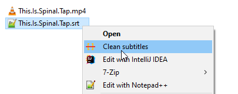

# subjob
NodeJs application that cleans your subtitle file of closed captions.

## Installation

1. Make sure you have Node.js installed on your system. If not, download and install it from [https://nodejs.org](https://nodejs.org/).
2. Clone or download this repository to your local machine.
3. Navigate to the repository folder in your terminal or command prompt.
4. Run `npm install` to install the necessary dependencies.

## Usage

To run the application, execute the following command in your terminal or command prompt, replacing `<path_to_srt_file>` with the actual path to the SRT file you want to process:

```
node app.js <path_to_srt_file>
```

## The cool way (Windows)
Process a subtitle file by right clicking on it and launching the program from the context menu.



### Create context menu item
1. Press **Win + R** to open the Run dialog box, type `regedit`, and press Enter. This will open the Windows Registry Editor.
2. Navigate to the following location:
```
HKEY_CLASSES_ROOT\SystemFileAssociations
```
3. Right click on the **SystemFileAssociations** key and select **New > Key**. Name the new key `.srt`.
4. Right-click on the **.srt** key, select **New > Key**, and name the new key `shell`.
5. Right-click on the **shell** key, select **New > Key**, and name the new key `Clean subtitles`.
6. With the **Clean subtitles** key selected, right-click in the right pane, select **New > String Value**, and name it `icon`. Double-click the **icon** value and set its data to the path of the subjob icon, for example:
```
C:\Users\JohnDoe\subjob\subjob.ico
```
7. Right-click on the **Clean subtitles** key again, select **New > Key**, and name it `command`.
8. Select the **command** key, and in the right pane, double-click on the **(Default)** value. Set its data to the following command, replacing the path to node.exe and the path to your specific subjob application script with the correct ones for your system:
```
"C:\Program Files\nodejs\node.exe" "C:\Users\JohnDoe\subjob\app.js" "%1"
```
9. Close the Registry Editor.

Now, when you right-click on a **.srt** file in Windows Explorer, you should see a **"Clean subtitles"** option in the context menu. This option should be visible only for **.srt** files.

If you still don't see the custom context menu option, it might be related to a registry caching issue. In that case, try restarting your computer or restarting the Windows Explorer process.